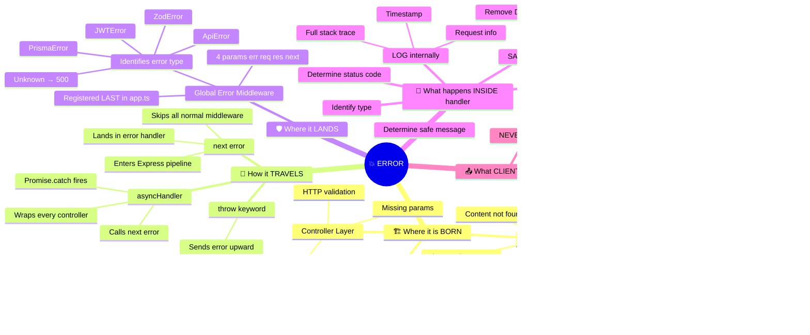
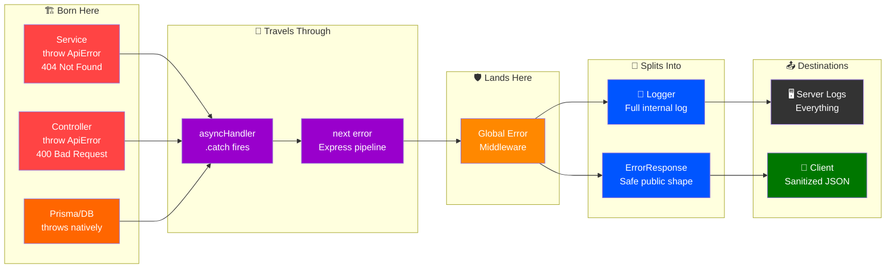
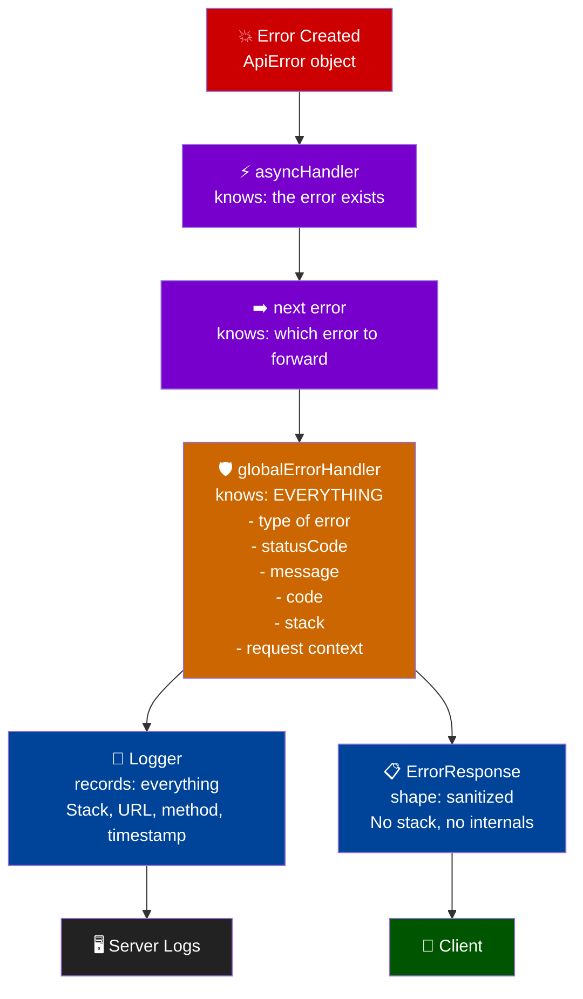
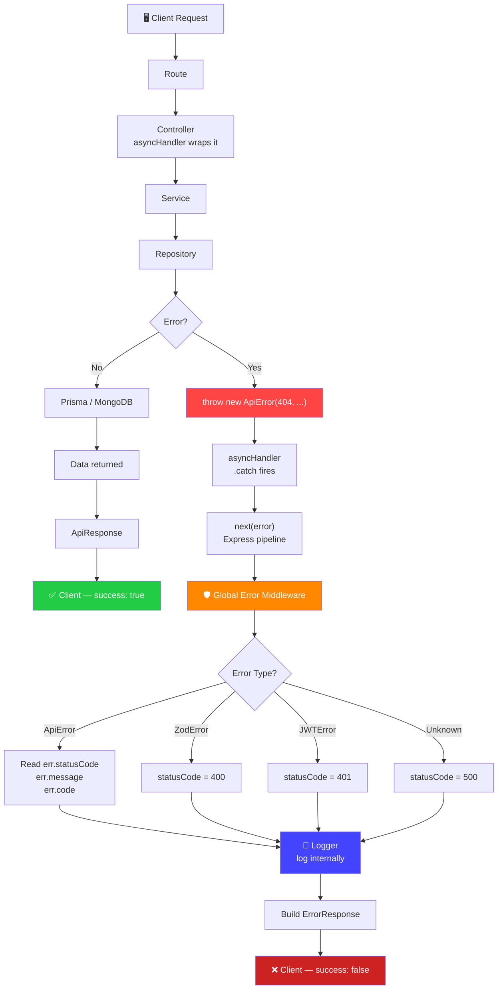

# 🔴 Error Handling in Production — Second Brain Backend

> **This is your personal reference doc. Every confusion, every "why", every "what is this" — answered here.**
> Built from your real ChatGPT sessions. Refer back whenever you are lost.

---

> [!CAUTION]
> **Before reading anything else — burn this into memory:**
>
> ```
> Create → Forward → Handle → Log → Format → Respond
>
> ApiError  →  asyncHandler  →  next(error)  →  globalErrorHandler  →  Logger + ErrorResponse  →  Client
> ```
>
> Every section below just explains this one line in detail.

---

## 📌 Table of Contents

0. [🧠 Mind Map — Error Generation & Transfer](#0--mind-map--error-generation--transfer)

1. [🗺️ The Big Picture — Two Paths](#1-️-the-big-picture--two-paths)
2. [🔁 Complete Error Flow Diagram](#2--complete-error-flow-diagram)
3. [🏗️ Your Error Architecture — File Map](#3-️-your-error-architecture--file-map)
4. [🔴 Layer 1 — ApiError.ts](#4--layer-1--apierrorts)
5. [⚡ Layer 2 — asyncHandler.ts](#5--layer-2--asynchandlerts)
6. [➡️ Layer 3 — next(error)](#6-️-layer-3--nexterror)
7. [🛡️ Layer 4 — Global Error Middleware](#7-️-layer-4--global-error-middleware)
8. [📋 Layer 5 — ErrorResponse Interface](#8--layer-5--errorresponse-interface)
9. [📝 Layer 6 — Logger](#9--layer-6--logger)
10. [✅ ApiResponse vs ❌ ErrorResponse](#10--apiresponse-vs--errorresponse)
11. [🧱 DTO vs ApiResponse — Your Confusion Cleared](#11--dto-vs-apiresponse--your-confusion-cleared)
12. [⚠️ Expected vs Unexpected Errors](#12-️-expected-vs-unexpected-errors)
13. [🔎 Full Example — 404 Content Not Found](#13--full-example--404-content-not-found)
14. [💥 Full Example — Unexpected Database Error](#14--full-example--unexpected-database-error)
15. [📊 Master Responsibility Table](#15--master-responsibility-table)
16. [💬 Your Confusions — Answered](#16--your-confusions--answered)

---

## 0. 🧠 Mind Map — Error Generation & Transfer

> How an error is born, where it lives, how it moves, and where it dies.



### Error Transfer Chain — Layer by Layer



### What each layer OWNS about the error



---

## 1. 🗺️ The Big Picture — Two Paths

Every request to your backend takes one of two paths:

### ✅ Happy Path (Success)

```
Client
  ↓
Route
  ↓
Controller         ← asyncHandler wraps this
  ↓
Service
  ↓
Repository
  ↓
Prisma / MongoDB
  ↑
Repository
  ↑
Service
  ↑
Controller
  ↓
ApiResponse<T>     ← wraps the data
  ↓
Client             ← { success: true, statusCode: 200, data: {...} }
```

### ❌ Error Path (Failure)

```
Client
  ↓
Route
  ↓
Controller
  ↓
Service
  ↓  ← Error occurs HERE (most common)
throw ApiError(...)
  ↓
asyncHandler       ← .catch(next) fires
  ↓
next(error)        ← enters Express error pipeline
  ↓
Global Error Middleware
  ↓           ↓
Logger    ErrorResponse
  ↓           ↓
Server     Client
 Logs      { success: false, statusCode: 404, message: "..." }
```

> [!IMPORTANT]
> **Errors always travel UPWARD through the layers until they hit the Global Error Middleware.**
> Your code at each layer does not need to handle errors — just throw them and let them bubble up.

---

## 2. 🔁 Complete Error Flow Diagram



---

## 3. 🏗️ Your Error Architecture — File Map

```
src/
│
├── utils/
│   ├── ApiError.ts          ← 🔴 Creates structured errors
│   ├── asyncHandler.ts      ← ⚡ Catches async errors, calls next(error)
│   └── ApiResponse.ts       ← ✅ For SUCCESS responses only
│
├── middleware/
│   ├── error.middleware.ts  ← 🛡️ Central error handler (REGISTER LAST)
│   └── notFound.middleware.ts
│
├── types/
│   └── common.types.ts      ← 📋 ErrorResponse interface lives here
│
└── config/
    └── logger.ts            ← 📝 Internal server logging
```

| File | What it does | When it runs |
|---|---|---|
| `ApiError.ts` | Creates the error object | When YOU throw it in service/controller |
| `asyncHandler.ts` | Catches the thrown error | Automatically — wraps your controllers |
| `error.middleware.ts` | Handles, logs, responds | After every route, registered last |
| `common.types.ts` | TypeScript shape of response | Design-time type checking |
| `logger.ts` | Records to server logs | Inside globalErrorHandler |

---

## 4. 🔴 Layer 1 — ApiError.ts

### What is it?

Your **custom error class** that extends JavaScript's built-in `Error`.

### Why not just `throw new Error()`?

| Feature | `new Error()` | `new ApiError()` |
|---|---|---|
| message | ✅ | ✅ |
| stack trace | ✅ | ✅ |
| HTTP statusCode | ❌ | ✅ |
| error code | ❌ | ✅ |
| details | ❌ | ✅ |
| isOperational flag | ❌ | ✅ |

### Your actual ApiError.ts

```typescript
// src/utils/ApiError.ts
export class ApiError extends Error {
    public readonly statusCode: number;
    public readonly isOperational: boolean;
    public readonly code?: string;
    public readonly details?: unknown;

    constructor(
        statusCode: number,
        message: string,
        options?: {
            code?: string;
            details?: unknown;
            isOperational?: boolean;
        }
    ) {
        super(message);

        this.name = "ApiError";
        this.statusCode = statusCode;
        this.isOperational = options?.isOperational ?? true;
        this.code = options?.code;
        this.details = options?.details;

        Error.captureStackTrace(this, this.constructor);
    }
}
```

### What object does it create?

When you write:

```typescript
throw new ApiError(404, "Content not found", {
    code: "CONTENT_NOT_FOUND"
});
```

You are creating this object in memory:

```
ApiError
├── name          → "ApiError"
├── message       → "Content not found"
├── statusCode    → 404
├── code          → "CONTENT_NOT_FOUND"
├── details       → undefined
├── isOperational → true
└── stack         → Error at Service.getContent (service.ts:42)
```

### Why each property exists

#### `statusCode`

Because plain `Error` doesn't know about HTTP. Without it:

```
throw new Error("Not found")
         ↓
Global handler
         ↓
❓ Should I send 400? 404? 500?
```

With it:

```
throw new ApiError(404, "Not found")
         ↓
Global handler
         ↓
✅ 404 — clear
```

#### `code`

Machine-readable identifier for your frontend:

```typescript
// Frontend can do:
if (error.code === "CONTENT_NOT_FOUND") {
    // show specific UI
}
```

#### `details`

Extra structured information, especially for validation:

```typescript
throw new ApiError(400, "Validation failed", {
    code: "VALIDATION_ERROR",
    details: {
        field: "url",
        reason: "Invalid URL format"
    }
});
```

#### `isOperational`

Distinguishes expected errors from programming bugs:

- `true` → you expected this (404, 401, 409) — **operational**
- `false` / not set for unknown errors → bug or system failure — **programming error**

### Where do you use ApiError?

```
Controller  → HTTP-level validation (missing params, bad format)
Service     → Business logic errors (not found, unauthorized, duplicate)
Repository  → Usually just let Prisma errors bubble — rarely throw ApiError here
```

> [!WARNING]
> **`throw new ApiError()` does NOT send a response to the client.**
> It only creates and throws an error object.
> The Global Error Middleware is what actually responds.

> [!TIP]
> **ApiError is "optional" technically** — you can throw plain `new Error()`.
> But for a production backend, always use `ApiError` so your global handler knows the status code.

---

## 5. ⚡ Layer 2 — asyncHandler.ts

### The problem it solves

Your controllers are `async`:

```typescript
const getContent = async (req, res) => {
    const data = await contentService.getContent(req.params.id);
    res.json(data);
};
```

If `contentService.getContent()` throws — Express **won't catch it automatically** in async functions.

Without `asyncHandler`, you'd write this in EVERY controller:

```typescript
const getContent = async (req, res, next) => {
    try {
        const data = await contentService.getContent(req.params.id);
        res.json(data);
    } catch (error) {
        next(error); // 😩 repeat this everywhere
    }
};
```

### The solution

```typescript
// src/utils/asyncHandler.ts
const asyncHandler = (handler) => {
    return (req, res, next) => {
        Promise
            .resolve(handler(req, res, next))
            .catch(next); // ← automatically calls next(error)
    };
};
```

### How it works

```
Controller throws ApiError
         ↓
Promise rejects
         ↓
.catch(next) fires
         ↓
next(error) called automatically
         ↓
Express enters error pipeline
```

### Usage

```typescript
export const getContent = asyncHandler(async (req, res) => {
    // if this throws → asyncHandler catches → next(error) → globalErrorHandler
    const content = await contentService.getContent(req.params.id, req.user.id);

    return res.status(200).json(
        new ApiResponse(200, "Content fetched successfully", content)
    );
});
```

> [!NOTE]
> `asyncHandler` doesn't create errors, doesn't handle errors, doesn't log errors.
> It is **only a bridge** — it ensures async errors reach `next(error)`.

---

## 6. ➡️ Layer 3 — next(error)

### What is `next()`?

`next()` is Express's way to move to the next middleware.

```typescript
next();        // ← "continue normally, go to next middleware"
next(error);   // ← "an error happened, go to error-handling middleware"
```

### How Express recognizes error middleware

Express specifically looks for middleware with **4 parameters**:

```typescript
// Normal middleware — 3 params
app.use((req, res, next) => { ... });

// Error middleware — 4 params (err FIRST)
app.use((err, req, res, next) => { ... }); // ← globalErrorHandler
```

When you call `next(error)`, Express skips all normal middleware and jumps straight to the error-handling middleware.

> [!IMPORTANT]
> **`next(error)` is not a layer you write yourself.**
> `asyncHandler` calls it automatically via `.catch(next)`.
> You just need to understand what it does.

---

## 7. 🛡️ Layer 4 — Global Error Middleware

### What is it?

The **single central place** where ALL errors from your entire application land and get processed.

**File:** `src/middleware/error.middleware.ts`

### Registration in app.ts — MUST be last

```typescript
// app.ts
app.use("/api/v1", routes);        // ← your routes first

app.use(notFoundMiddleware);        // ← 404 for unknown routes

app.use(globalErrorHandler);        // ← ALWAYS LAST — catches everything above
```

> [!CAUTION]
> **If globalErrorHandler is registered BEFORE routes, it won't catch route errors.**
> Express processes middleware top-to-bottom. Put it last.

### What globalErrorHandler does — all 7 jobs

```
Receive error (err, req, res, next)
         ↓
Job 1: Identify the error type
         ↓
Job 2: Determine the HTTP status code
         ↓
Job 3: Determine the safe message
         ↓
Job 4: Log the FULL error internally (Logger)
         ↓
Job 5: Hide sensitive information from client
         ↓
Job 6: Build ErrorResponse shape
         ↓
Job 7: res.status(statusCode).json(response)
```

### Error identification — what types it handles

```typescript
const globalErrorHandler = (err, req, res, next) => {

    let statusCode = 500;
    let message = "Internal Server Error";
    let code;

    // ✅ Your custom error — has everything we need
    if (err instanceof ApiError) {
        statusCode = err.statusCode;
        message = err.message;
        code = err.code;
    }

    // Zod validation error → 400
    else if (err instanceof ZodError) {
        statusCode = 400;
        message = "Validation failed";
    }

    // Prisma known errors → 400 or 409
    else if (err instanceof PrismaClientKnownRequestError) {
        if (err.code === "P2002") {
            statusCode = 409;
            message = "Resource already exists";
        }
    }

    // JWT errors → 401
    else if (err.name === "JsonWebTokenError") {
        statusCode = 401;
        message = "Invalid token";
    }

    // Everything else → 500
    // (do NOT expose internal message to client)

    logger.error({ statusCode, message, stack: err.stack });

    res.status(statusCode).json({
        success: false,
        statusCode,
        message,
        ...(code && { code }),
        ...(isDev && { stack: err.stack })
    });
};
```

### What it NEVER exposes to client

```
❌ Database credentials
❌ Stack traces (in production)
❌ Internal file paths
❌ Prisma internals
❌ Environment variables
❌ MongoDB connection strings
```

---

## 8. 📋 Layer 5 — ErrorResponse Interface

### What is it?

A **TypeScript interface** — a contract/shape definition.

```typescript
// src/types/common.types.ts
export interface ErrorResponse {
    success: false;      // always false for errors
    statusCode: number;  // 400, 401, 403, 404, 409, 500
    message: string;     // human-readable
    code?: string;       // optional machine-readable
    errors?: unknown;    // validation errors array
    stack?: string;      // dev only
}
```

### It is NOT a class. It does NOT create errors. It does NOT handle errors.

It simply defines: **"this is the shape every error response must follow."**

### Each field explained

| Field | Type | Purpose | Example |
|---|---|---|---|
| `success` | `false` (literal) | Always false for errors | `false` |
| `statusCode` | `number` | HTTP status | `404` |
| `message` | `string` | Human message | `"Content not found"` |
| `code?` | `string` | Machine identifier | `"CONTENT_NOT_FOUND"` |
| `errors?` | `unknown` | Validation details | `[{field, message}]` |
| `stack?` | `string` | Dev debug only | `"Error at..."` |

### What the client actually receives

```json
{
    "success": false,
    "statusCode": 404,
    "message": "Content not found",
    "code": "CONTENT_NOT_FOUND"
}
```

> [!TIP]
> `stack` should only be included in **development mode**.
> In production, never send stack traces to the client.

---

## 9. 📝 Layer 6 — Logger

### Why logging is separate from responding

The **server** needs to know everything about the error:

```
[ERROR] 2026-08-13T18:00:00Z
Method:  POST
URL:     /api/v1/content
Status:  500
Message: Connection timed out after 5000ms
Stack:   Error: Connection timed out
           at PrismaClient.connect (prisma/client.js:234)
           at Repository.create (repository.ts:18)
           ...
```

The **client** should receive nothing internal:

```json
{
    "success": false,
    "statusCode": 500,
    "message": "Internal Server Error"
}
```

### Rule

```
Logger        → for YOU (developer / DevOps)
ErrorResponse → for THEM (client / frontend)
```

These are two completely separate concerns. The global error handler does both — logs internally, responds safely.

---

## 10. ✅ ApiResponse vs ❌ ErrorResponse

These two handle **opposite** paths:

| | ApiResponse | ErrorResponse |
|---|---|---|
| When | Success | Error |
| `success` | `true` | `false` |
| Has `data` | ✅ Yes | ❌ No |
| Has `errors` | ❌ No | ✅ Optional |
| Class or Interface | Class | Interface |

```typescript
// Success — uses ApiResponse class
new ApiResponse(200, "Content fetched successfully", content)

// Error — globalErrorHandler builds this shape matching ErrorResponse interface
{ success: false, statusCode: 404, message: "Content not found" }
```

### Your actual ApiResponse.ts

```typescript
// src/utils/ApiResponse.ts
export class ApiResponse<T = unknown> {
    public readonly success = true;
    public readonly statusCode: number;
    public readonly message: string;
    public readonly data: T;

    constructor(statusCode: number, message: string, data: T) {
        this.statusCode = statusCode;
        this.message = message;
        this.data = data;
    }
}
```

---

## 11. 🧱 DTO vs ApiResponse — Your Confusion Cleared

> [!NOTE]
> **Your confusion:** "Is ApiResponse the same as a DTO?"
> **Short answer:** No. They serve completely different purposes.

### Think of it like this

```
DTO           → controls WHAT DATA is included/excluded
ApiResponse   → controls the RESPONSE FORMAT/ENVELOPE
```

### The full chain with DTO

```
Prisma User
├── id
├── username
├── email
├── password     ← 🔴 NEVER send this!
├── createdAt
└── updatedAt
         ↓
UserResponseDTO  ← filters out password
├── id
├── username
└── email
         ↓
ApiResponse<UserResponseDTO>  ← wraps in envelope
         ↓
Client
{
    "success": true,
    "statusCode": 200,
    "message": "User fetched successfully",
    "data": {
        "id": "...",
        "username": "abhinav",
        "email": "..."
    }
}
```

### DTO example

```typescript
interface UserResponseDTO {
    id: string;
    username: string;
    email: string;
    // password is NOT here — intentionally excluded
}
```

> [!IMPORTANT]
> **DTO = a filter/shape for what data is allowed out of a layer.**
> It is NOT the same as ApiResponse.
>
> For your current MVP: start with ApiResponse, add DTOs where you need to filter Prisma objects — especially for User/Auth to exclude `password`.

---

## 12. ⚠️ Expected vs Unexpected Errors

### Operational Errors (Expected — use `ApiError`)

These are conditions you **know can happen**:

```typescript
throw new ApiError(400, "Invalid input",           { code: "INVALID_INPUT" });
throw new ApiError(401, "Invalid password",         { code: "INVALID_PASSWORD" });
throw new ApiError(403, "Access denied",            { code: "FORBIDDEN" });
throw new ApiError(404, "Content not found",        { code: "CONTENT_NOT_FOUND" });
throw new ApiError(409, "Username already exists",  { code: "DUPLICATE_USERNAME" });
```

`isOperational: true` (default) → expected → log as warning/info.

### Programming/System Errors (Unexpected — bubble up)

These are conditions you **did NOT expect**:

```typescript
// These just bubble up naturally — don't manually ApiError these
Cannot read properties of undefined
Database connection failure
Network timeout
Unexpected Prisma error
Programming bug (typo, missing check)
```

`isOperational: false` / unknown error → critical → log as error/alert DevOps.

### How globalErrorHandler treats them differently

```
ApiError (isOperational: true)
    ↓
Use err.statusCode and err.message as-is
→ Send exact message to client

Unknown Error
    ↓
Force statusCode = 500
Force message = "Internal Server Error"
→ Hide everything from client
→ Log full details internally
```

---

## 13. 🔎 Full Example — 404 Content Not Found

**Request:** `GET /api/v1/content/123`

### Step-by-step trace

**1. Controller (wrapped with asyncHandler)**

```typescript
export const getContent = asyncHandler(async (req, res) => {
    const content = await contentService.getContent(req.params.id, req.user.id);

    return res.status(200).json(
        new ApiResponse(200, "Content fetched successfully", content)
    );
});
```

**2. Service — content doesn't exist**

```typescript
const content = await repository.findById(contentId, userId);

if (!content) {
    throw new ApiError(404, "Content not found", {
        code: "CONTENT_NOT_FOUND"
    });
}
```

**3. asyncHandler catches it**

```
throw ApiError
    ↓
Promise.reject(ApiError)
    ↓
.catch(next)
    ↓
next(ApiError)  ← Express now has the error
```

**4. Global Error Middleware receives it**

```typescript
// err = ApiError { statusCode: 404, message: "Content not found", code: "CONTENT_NOT_FOUND" }
if (err instanceof ApiError) {
    statusCode = err.statusCode;  // 404
    message = err.message;         // "Content not found"
    code = err.code;               // "CONTENT_NOT_FOUND"
}
```

**5. Logger records internally**

```
[WARN] 404 | Content not found | GET /api/v1/content/123
```

**6. Client receives**

```json
{
    "success": false,
    "statusCode": 404,
    "message": "Content not found",
    "code": "CONTENT_NOT_FOUND"
}
```

---

## 14. 💥 Full Example — Unexpected Database Error

Prisma / MongoDB unexpectedly fails:

```
Error: connect ECONNREFUSED 127.0.0.1:27017
```

**Trace:**

```
Prisma throws Error
    ↓
Repository (bubbles up — no catch)
    ↓
Service (bubbles up — no catch)
    ↓
Controller (bubbles up)
    ↓
asyncHandler (.catch(next) fires)
    ↓
next(error)
    ↓
Global Error Middleware
    ↓
err is NOT instanceof ApiError
    ↓
statusCode = 500
message = "Internal Server Error"   ← safe generic message
    ↓
Logger records FULL error internally:
    [ERROR] 500 | connect ECONNREFUSED | Stack: ...
    ↓
Client receives:
```

```json
{
    "success": false,
    "statusCode": 500,
    "message": "Internal Server Error"
}
```

> [!CAUTION]
> The real error message `"connect ECONNREFUSED 127.0.0.1:27017"` **NEVER reaches the client**.
> Only the logger and your server logs see it. This protects your infrastructure.

---

## 15. 📊 Master Responsibility Table

> [!IMPORTANT]
> **Memorize this table. It answers 90% of your confusion.**

| Component | Creates Error? | Handles Error? | Sends Response? | Logs? |
|---|:---:|:---:|:---:|:---:|
| `ApiError` | ✅ | ❌ | ❌ | ❌ |
| `asyncHandler` | ❌ | ❌ | ❌ | ❌ |
| `next(error)` | ❌ | ❌ | ❌ | ❌ |
| `globalErrorHandler` | ❌ | ✅ | ✅ | ✅ |
| `Logger` | ❌ | ❌ | ❌ | ✅ |
| `ErrorResponse` | ❌ | ❌ | ❌ | ❌ |
| `ApiResponse` | ❌ | ❌ | ✅ (success only) | ❌ |

### Is anything mandatory?

| Component | Mandatory? | Why |
|---|---|---|
| `ApiError` | ⚠️ Recommended | Technically optional, but gives structured HTTP status |
| `asyncHandler` | ⚠️ Recommended | Required for async controllers — else errors are lost |
| `ErrorResponse` | ⚠️ Recommended | Optional type contract, useful for TypeScript |
| `globalErrorHandler` | ✅ **Strongly recommended** | Without it, unhandled errors crash Express |

---

## 16. 💬 Your Confusions — Answered (Deep Dive)

---

### ❓ Confusion 1 — "Is ApiError mandatory?"

> [!NOTE]
> **Short answer:** No, technically not. But for production, always use it.

#### What happens WITHOUT ApiError

Suppose you just throw the built-in `Error`:

```typescript
// In your service
if (!content) {
    throw new Error("Content not found");
}
```

This creates a plain JS Error object in memory:

```
Error
├── message  → "Content not found"
└── stack    → Error at contentService.getContent (service.ts:42)
```

Notice what is **missing**:

```
❌ statusCode  — Express doesn't know if this is 400, 404, or 500
❌ code        — no machine-readable identifier
❌ details     — no extra context
❌ isOperational — no way to tell if this is expected or a bug
```

Your `globalErrorHandler` receives this:

```typescript
const globalErrorHandler = (err, req, res, next) => {

    // err is just: Error { message: "Content not found" }
    // Is this a 404? A 400? We have NO idea.

    else if (err instanceof Error) {
        // in dev: shows the message
        // in production: hides it — always "Internal Server Error"
        if (!isProduction) {
            message = err.message;
        }
    }

    // statusCode is still 500 (the default)
};
```

**Client receives in production:**

```json
{
    "success": false,
    "statusCode": 500,
    "message": "Internal Server Error"
}
```

That is wrong — it was a 404, but the client got a 500.

---

#### What happens WITH ApiError

```typescript
if (!content) {
    throw new ApiError(404, "Content not found", {
        code: "CONTENT_NOT_FOUND"
    });
}
```

Object in memory:

```
ApiError
├── name          → "ApiError"
├── message       → "Content not found"
├── statusCode    → 404           ← Express now knows
├── code          → "CONTENT_NOT_FOUND"
├── isOperational → true
└── stack         → ...
```

`globalErrorHandler` reads it:

```typescript
if (err instanceof ApiError) {
    statusCode = err.statusCode;  // 404
    message = err.message;         // "Content not found"
    code = err.code;               // "CONTENT_NOT_FOUND"
}
```

**Client receives:**

```json
{
    "success": false,
    "statusCode": 404,
    "message": "Content not found",
    "code": "CONTENT_NOT_FOUND"
}
```

**Summary:**

```
Without ApiError:
throw new Error("not found")  →  globalErrorHandler has NO statusCode  →  defaults to 500  →  ❌ wrong

With ApiError:
throw new ApiError(404, ...)  →  globalErrorHandler reads 404  →  ✅ correct status + code
```

---

### ❓ Confusion 2 — "ApiError ≠ ErrorResponse — what exactly is the difference?"

> [!IMPORTANT]
> One is a **class** that lives inside your backend. The other is a **TypeScript interface** defining what JSON the client sees.

#### ApiError — lives INSIDE your backend (can contain sensitive info)

```typescript
// CLASS — you throw an instance of it
throw new ApiError(500, "MongoDB connection failed", {
    code: "DB_CONNECTION_ERROR",
    details: {
        host: "localhost",
        port: 27017,
        error: "ECONNREFUSED"       // ← internal! never send this to client
    }
});
```

Object in memory:

```
ApiError {
    name:          "ApiError"
    message:       "MongoDB connection failed"
    statusCode:    500
    code:          "DB_CONNECTION_ERROR"
    details: {
        host:  "localhost"          // ← sensitive
        port:  27017                // ← sensitive
        error: "ECONNREFUSED"       // ← sensitive
    }
    isOperational: true
    stack:         "Error at Repository.create..."  // ← sensitive
}
```

If you blindly sent ALL of this to the client — database host, port, internals — that is a security hole.

---

#### ErrorResponse — defines what the CLIENT receives (sanitized)

```typescript
// INTERFACE — zero runtime behavior, just a type shape
export interface ErrorResponse {
    success: false;
    statusCode: number;
    message: string;
    code?: string;
    errors?: unknown;
    stack?: string;      // only in development
}
```

It is a contract: "every error response from this backend must match this shape."

---

#### globalErrorHandler is the bridge — it filters ApiError into ErrorResponse

```typescript
const globalErrorHandler = (err, req, res, next) => {

    // RECEIVE: full ApiError (possibly with sensitive internal details)
    let statusCode = 500;
    let message = "Internal Server Error";

    if (err instanceof ApiError) {
        statusCode = err.statusCode;   // 500
        message = err.message;          // "MongoDB connection failed"
        // err.details (host, port, ECONNREFUSED) → NOT included in response
    }

    // BUILD: safe ErrorResponse shape — sensitive data stripped
    const response: ErrorResponse = {
        success: false,
        statusCode,
        message,    // in production for unknown errors → "Internal Server Error"
    };

    // SEND: sanitized, safe
    res.status(statusCode).json(response);
};
```

**Client receives (production):**

```json
{
    "success": false,
    "statusCode": 500,
    "message": "Internal Server Error"
}
```

`host`, `port`, `ECONNREFUSED` — **never exposed.**

---

#### Visual: what stays vs what goes out

```
ApiError (PRIVATE — inside backend)
┌────────────────────────────────────────┐
│ message:    "MongoDB connection failed"│
│ statusCode: 500                        │ ← ✅ safe to expose
│ code:       "DB_CONNECTION_ERROR"      │ ← ✅ safe to expose
│ details:    { host, port, ECONNREFUSED}│ ← ❌ NEVER sent
│ stack:      "Error at Repository..."   │ ← ❌ NEVER sent (production)
└──────────────────────┬─────────────────┘
                       │
             globalErrorHandler filters
                       │
                       ▼
ErrorResponse (PUBLIC — sent to client)
┌────────────────────────────────────────┐
│ success:    false                      │
│ statusCode: 500                        │
│ message:    "Internal Server Error"    │ ← generic, safe
└────────────────────────────────────────┘
```

---

### ❓ Confusion 3 — "Is DTO a type of filter for what gets responded?"

> [!NOTE]
> **Yes, exactly.** A DTO is a filter/shape that controls what data is allowed to leave a layer.

#### The problem without a DTO

Prisma returns your full `User`:

```typescript
const user = await prisma.user.findUnique({ where: { id: userId } });

// user object in memory:
{
    id:        "clxyz123",
    username:  "abhinav",
    email:     "abhinav@email.com",
    password:  "$2b$10$abc...hashed_password",   // ← NEVER send this
    createdAt: "2026-08-01T...",
    updatedAt: "2026-08-13T..."
}
```

If you return it directly:

```typescript
return res.status(200).json(
    new ApiResponse(200, "User fetched", user)   // ← sends everything!
);
```

**Client receives:**

```json
{
    "success": true,
    "data": {
        "id": "clxyz123",
        "username": "abhinav",
        "email": "abhinav@email.com",
        "password": "$2b$10$abc...",   ← 🔴 EXPOSED — security disaster
        "createdAt": "...",
        "updatedAt": "..."
    }
}
```

---

#### Fix — UserResponseDTO as a filter

```typescript
// Define DTO — only the fields you want exposed
interface UserResponseDTO {
    id: string;
    username: string;
    email: string;
    // password intentionally NOT here
}
```

In your service, map Prisma object → DTO:

```typescript
const prismaUser = await prisma.user.findUnique({ where: { id: userId } });

// Filter step: only keep safe fields
const userDTO: UserResponseDTO = {
    id:       prismaUser.id,
    username: prismaUser.username,
    email:    prismaUser.email,
    // password not mapped — gone
};

return userDTO;
```

Controller:

```typescript
const user = await userService.getUser(userId);   // returns UserResponseDTO

return res.status(200).json(
    new ApiResponse(200, "User fetched successfully", user)
);
```

**Client receives:**

```json
{
    "success": true,
    "statusCode": 200,
    "message": "User fetched successfully",
    "data": {
        "id": "clxyz123",
        "username": "abhinav",
        "email": "abhinav@email.com"
    }
}
```

`password` is gone. ✅

---

#### DTO vs ApiResponse — not the same thing

```
DTO           → answers: "WHICH FIELDS go through?"
               works at the data/content level
               Example: UserResponseDTO excludes password

ApiResponse   → answers: "WHAT FORMAT does the envelope take?"
               works at the wrapper level
               Example: { success, statusCode, message, data }
```

Full correct chain:

```
Prisma User (id, username, email, password, createdAt, updatedAt)
         ↓
UserResponseDTO        ← FILTER: keeps only id, username, email
         ↓
ApiResponse<UserResponseDTO>  ← WRAP: adds success, statusCode, message
         ↓
Client: { success: true, data: { id, username, email } }
```

---

### ❓ Confusion 4 — "Where exactly is ApiError used — controller or globalErrorHandler?"

> [!IMPORTANT]
> **You CREATE ApiError in Service/Controller.**
> **globalErrorHandler only READS it — it never creates one.**

#### Where you CREATE it (your business logic files)

```typescript
// content.service.ts
import { ApiError } from "../utils/ApiError";

export const getContent = async (contentId: string, userId: string) => {
    const content = await contentRepository.findById(contentId, userId);

    if (!content) {
        throw new ApiError(404, "Content not found", {   // ← CREATED here
            code: "CONTENT_NOT_FOUND"
        });
    }

    return content;
};
```

```typescript
// auth.service.ts
import { ApiError } from "../utils/ApiError";

export const login = async (email: string, password: string) => {
    const user = await userRepository.findByEmail(email);

    if (!user) {
        throw new ApiError(401, "Invalid credentials", {   // ← CREATED here
            code: "INVALID_CREDENTIALS"
        });
    }

    const valid = await bcrypt.compare(password, user.password);

    if (!valid) {
        throw new ApiError(401, "Invalid credentials", {   // ← CREATED here
            code: "INVALID_CREDENTIALS"
        });
    }

    return user;
};
```

---

#### Where it is HANDLED (middleware — never creates, only reads)

```typescript
// error.middleware.ts
import { ApiError } from "../utils/ApiError";  // ← imported to RECOGNISE it

const globalErrorHandler = (err, req, res, next) => {

    // globalErrorHandler NEVER does: throw new ApiError(...)
    // It only RECEIVES and READS an ApiError that was thrown elsewhere

    if (err instanceof ApiError) {       // ← is this the type we know?
        statusCode = err.statusCode;      // ← read statusCode
        message = err.message;             // ← read message
        code = err.code;                   // ← read code
        errors = err.details;              // ← read details
    }

    // ...then logs and responds
};
```

---

#### Full journey of one ApiError

```
content.service.ts
    throw new ApiError(404, "Content not found", { code: "CONTENT_NOT_FOUND" })
              │
              │ thrown upward through call stack
              ▼
asyncHandler (wraps the controller)
    .catch(next) fires
    next(ApiError) called
              │
              ▼
Express error pipeline
              │
              ▼
error.middleware.ts — globalErrorHandler
    err = ApiError { statusCode: 404, message: "Content not found", code: "CONTENT_NOT_FOUND" }
    reads statusCode → 404
    reads message    → "Content not found"
    reads code       → "CONTENT_NOT_FOUND"
    logs internally
    builds ErrorResponse
              │
              ▼
Client: { success: false, statusCode: 404, message: "Content not found", code: "CONTENT_NOT_FOUND" }
```

**Rule:**

```
ApiError.ts         → imported in service/controller → you THROW it
error.middleware.ts → imported there too            → only to RECOGNISE it (instanceof check)
```

---

### ❓ Confusion 5 — "Why does globalErrorHandler have to be registered LAST?"

> [!CAUTION]
> Express is **strictly sequential** — middleware runs in the exact order you register it.

#### WRONG order — what happens

```typescript
// app.ts — WRONG
app.use(globalErrorHandler);     // ← registered FIRST (mistake!)
app.use("/api/v1", routes);      // ← routes after
```

Request flow:

```
GET /api/v1/content/123
         ↓
globalErrorHandler runs FIRST
No error yet — _next() called, moves on
         ↓
Routes run
Service throws ApiError(404)
asyncHandler → next(error)
         ↓
Express looks FORWARD for error middleware
globalErrorHandler is ALREADY PASSED — can't go back
         ↓
❌ No error handler found — Express sends default error or crashes
```

---

#### CORRECT order — what happens

```typescript
// app.ts — CORRECT
app.use("/api/v1", routes);      // ← routes first
app.use(notFoundMiddleware);      // ← unmatched route → next(ApiError 404)
app.use(globalErrorHandler);      // ← LAST: catches everything above
```

Request flow:

```
GET /api/v1/content/123
         ↓
Routes run — matched
Service throws ApiError(404)
asyncHandler → next(error)
         ↓
Express scans FORWARD
Finds globalErrorHandler (registered after routes, has 4 params)
         ↓
✅ statusCode = 404, correct response sent
```

---

#### Why notFoundMiddleware sits in the middle

```typescript
app.use("/api/v1", routes);

// If no route matched above, the request falls through to here:
app.use(notFoundMiddleware);
// Does: next(new ApiError(404, `Route not found: GET /api/v1/unknown`, { code: "ROUTE_NOT_FOUND" }))

// That ApiError lands in:
app.use(globalErrorHandler);
// Handles it exactly like any other ApiError → 404 response
```

---

### ❓ Confusion 6 — "What is `isOperational` actually used for?"

> [!NOTE]
> Separates **errors you planned for** (expected business logic) from **errors that are bugs/system failures**.

#### Operational: true — you expected this

```typescript
// These are NORMAL outcomes of your business logic
throw new ApiError(404, "Content not found",      { isOperational: true }); // default
throw new ApiError(401, "Invalid password",        { isOperational: true });
throw new ApiError(409, "Username already exists", { isOperational: true });
throw new ApiError(403, "Access denied",           { isOperational: true });
throw new ApiError(400, "Validation failed",       { isOperational: true });
```

A user typed a wrong password → expected. A user tried a duplicate username → expected. `isOperational: true` is the **default** in your `ApiError` class.

---

#### Non-operational — you did NOT expect this

```typescript
// These are BUGS or SYSTEM FAILURES — not your business logic
new TypeError("Cannot read properties of undefined (reading 'id')")
// Prisma: Cannot connect to database server at 127.0.0.1:27017
// Out of memory
// Network timeout to external service
```

These bubble up as raw `Error` objects — you never wrote `throw new ApiError(...)` for them.

---

#### How globalErrorHandler uses isOperational

```typescript
const globalErrorHandler = (err, req, res, next) => {

    if (err instanceof ApiError && err.isOperational) {
        // OPERATIONAL — you wrote this error intentionally
        // Safe to use err.statusCode and err.message directly
        statusCode = err.statusCode;
        message = err.message;

        // Log as WARN — this is normal expected behaviour
        console.warn("Operational error:", { statusCode, message });

    } else {
        // NON-OPERATIONAL — unexpected crash or programming bug
        // DO NOT send internal message to client
        statusCode = 500;
        message = "Internal Server Error";

        // Log as ERROR — needs investigation
        console.error("CRITICAL — Unexpected error:", err);
        // In real production: trigger Sentry / Slack / PagerDuty alert
    }
};
```

---

#### Why it matters in monitoring

```
isOperational: true  (404, 401, 409)
→ Log level: WARN
→ Action: nothing — user made a mistake, totally normal
→ Do NOT wake anyone up

isOperational: false (DB crash, programming bug, memory error)
→ Log level: ERROR / CRITICAL
→ Action: ALERT DevOps immediately — something is broken
→ Wake someone up at 3am if needed
```

---

### ❓ Confusion 7 — "Is asyncHandler just a try/catch wrapper?"

> [!TIP]
> Yes, conceptually. The key insight: **you write it once, it protects every async controller automatically.**

#### WITHOUT asyncHandler — repeating try/catch everywhere

```typescript
// content.controller.ts
export const getContent = async (req: Request, res: Response, next: NextFunction) => {
    try {
        const content = await contentService.getContent(req.params.id, req.user.id);
        res.status(200).json(new ApiResponse(200, "Fetched", content));
    } catch (error) {
        next(error);   // 😩 must write this in EVERY controller
    }
};

export const createContent = async (req: Request, res: Response, next: NextFunction) => {
    try {
        const content = await contentService.createContent(req.body, req.user.id);
        res.status(201).json(new ApiResponse(201, "Created", content));
    } catch (error) {
        next(error);   // 😩 again
    }
};

export const deleteContent = async (req: Request, res: Response, next: NextFunction) => {
    try {
        await contentService.deleteContent(req.params.id, req.user.id);
        res.status(200).json(new ApiResponse(200, "Deleted", null));
    } catch (error) {
        next(error);   // 😩 and again
    }
};
```

Every controller has the same 3-line boilerplate. Repetitive, easy to forget, violates DRY.

---

#### WITH asyncHandler — clean controllers, written once

```typescript
// utils/asyncHandler.ts — written ONCE
export const asyncHandler = (
    handler: (req: Request, res: Response, next: NextFunction) => Promise<unknown>
): RequestHandler => {
    return (req, res, next) => {
        Promise.resolve(handler(req, res, next)).catch(next);
        //                                              ↑
        //                       .catch(next) IS the try/catch
        //                       anything that throws → next(error) fires automatically
    };
};
```

Now controllers are completely clean:

```typescript
// content.controller.ts — no try/catch anywhere
export const getContent = asyncHandler(async (req, res) => {
    const content = await contentService.getContent(req.params.id, req.user.id);
    res.status(200).json(new ApiResponse(200, "Fetched", content));
    // if contentService throws → asyncHandler .catch(next) fires → globalErrorHandler
});

export const createContent = asyncHandler(async (req, res) => {
    const content = await contentService.createContent(req.body, req.user.id);
    res.status(201).json(new ApiResponse(201, "Created", content));
});

export const deleteContent = asyncHandler(async (req, res) => {
    await contentService.deleteContent(req.params.id, req.user.id);
    res.status(200).json(new ApiResponse(200, "Deleted", null));
});
```

No try/catch. No manual `next`. Every throw automatically reaches `globalErrorHandler`.

---

#### What `.catch(next)` literally means

```typescript
Promise.resolve(handler(req, res, next)).catch(next);

// This is exactly equivalent to:
try {
    await handler(req, res, next);
} catch (error) {
    next(error);   // forwards error to Express error pipeline
}

// .catch(next) is shorthand for:
// .catch((error) => next(error))
```

---

*📅 Last updated: August 2026 | Second Brain Backend*
